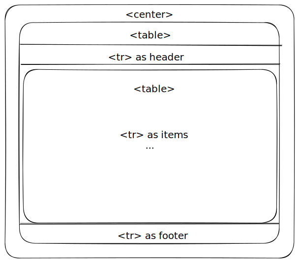

[Hacker News](https://news.ycombinator.com/) is probably one of the few top sites
with a table layout. A call from the distant past. 

## The Front Page

The front page is just a table inside `<center>` tag. The "More" button at the bottom leads to another page, which is loaded with a new HTTP request.

The main content is again a `<table>` inside `<tr>`, with each of its row as a
news entry.



Page style is controlled by a CSS file which is only 178 lines. The mobile style
is controlled with `@media` queries. All very simple.

The `@media only screen` is used in various places of the CSS file. Its use is
to prevent older browsers (which don't support media queries) from loading the
styles. See [MDN](https://developer.mozilla.org/en-US/docs/Web/CSS/CSS_media_queries/Using_media_queries#improving_compatibility_with_older_browsers).

## The Vote Button

Interestingly, there is style definition that rotates the upvote arrow:

```css
.rotate180 {
  ... /* 4 other lines for old browsers */
  transform:         rotate(180deg);
```

But I can't seem to find it in the UI. Turned out that only people with 100+
karma can downvote. I with my puny 11 karma can't do nothing.

BTW, the SVG file is already quite small, fewer bytes that the CSSlines. It 
might just load faster if they use a different SVG for downvote, but I don't
know.

## The Stories

Each comment is a table. The tree indentation is implemented with a placeholder 
gif image inside a `<td>`. The image width is fixated to the indentation level,
first level 40px, second 80px, etc.

The expanding/collapsing is controlled by a callback function. The total lines
of JavaScript is just 151, and it's not compressed in any way. Remarkable.