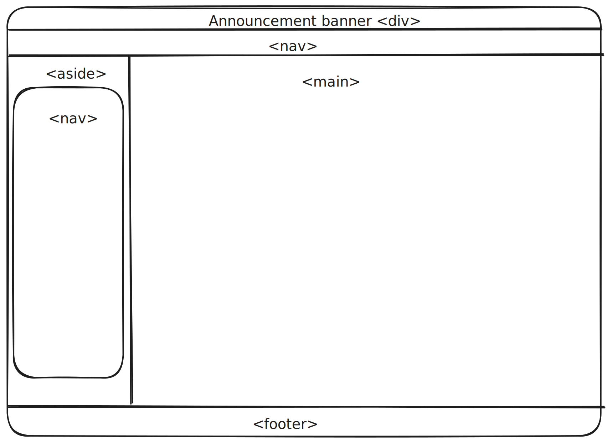

[Docusaurus](https://docusaurus.io/) is Meta's open source document authoring
platform. It generates clean and modern document sites written in markdown.

## The Major Takeaway

It uses semantic HTML tags for each major part of the screen.

This is so clean we can copy over to any website we want to create.

## It is React

In fact it is a React Single Page App with local routing. AND it is powerful. So powerful.

The only gripe I have is that like any React App, major version update can be a bit of PITA. There is already two major version updates, and the [migration pages](https://docusaurus.io/docs/migration) looks a bit daunting isn't it. With for example Python's Sphinx, you could migrate 10 year's version change in 10 minutes. (I did it and I know it)

But Docusaurus is pretty. Who can resist that?

## Styling

Under the hood Docusaurus uses a styling framework called [Infima](https://infima.dev/). From the look of it, it is a Tailwind like framework, but with abstractions to facilitate component and layout creation. A typical 20 class name Tailwind style instruction could be created with Infima in two or three class names. It still isn't production ready outside of Docusaurus, though.
