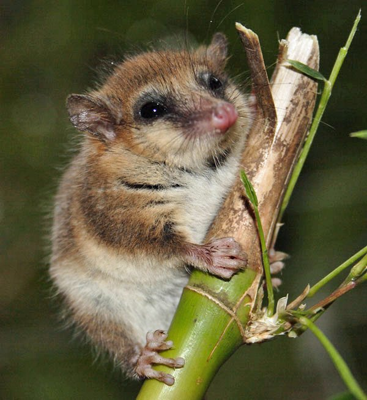

+++
date = "2020-12-27"
title = "24 Days of Hanzi"
tags = [
    "Chinese"
]
series = ["24 Days of Hanzi"]
authors = ["Weiwei"]
+++

## Preface

24 Days of Hanzi for Christmas 2020, originally published in Twitter.

## Day 1

#24DaysOfHanzi 咖


Have you noticed that 咖 is pronounced kā in 咖啡(kāfēi, coffee), and gā in 咖喱(gāli, curry)? 

I didn't notice until yesterday, though I already knew. Human brains are funny devices.

The word 咖喱 doesn't sound much like the English "curry", to the point that for long I've had a misconception that garlic means 咖喱. Now that I know 咖喱 is the phonetic translation of the Tamil word "kari", I feel much better. Though I still don't know why it has to be "gā".

There's another usage: a 大咖(dàkā) is the main cast of a movie or show. By extension it can also refer to any kind of person of importance. 

Here 咖 is the phonetic translation of "casting". 

Personally I use 大咖 I mean "connoisseur", but that could be just me.

## Day 2

#24DaysOfHanzi 樟 zhāng


If you walk the streets in the winter of southern China and you see evergreen trees by the roadside with no particular features, chances are you are seeing the 香樟, the camphor tree.


If you want to confirm, the seeds and leaves have a distinct fragrance when crushed, so it's hard to miss. 

https://en.wikipedia.org/wiki/Cinnamomum_camphora

樟 is a pictophonetic character in which 木 is the radical which indicates that it's related to trees, and 章(zhāng) indicates the pronunciation. Characters containing 章 including 彰(manifest), 獐(Chinese water deer), 瘴(miasma), etc. They all share the same pronunciation.

There is also 障(hindrance, barricade) that is the 4th tone.

In Japan the tree is also known as 楠. However, the name 楠 in China is a different tree species.

## Day 3

#24DaysOfHanzi 家 jiā


家 is home and hearth. It's where there's a fireplace, or in the case of the Chinese, it's where the pig has a roof. In ancient China pigs are so priced that humans have to live outside(not true 
Rolling on the floor laughing
)

家 is also someone who dominates a skill, as in 钢琴家(gāngqínjiā, pianist). 

Notice that "dominate" traces back to Latin domus(master's house), dominus(the master), dominatus(verbify). Convergent evolution much? Except no slavery is involved in 家.

But these are not today's topic. The topic is "why is there a place called 陆家嘴(lùjiāzuǐ) in Shanghai?

陆 is a common family name, so 陆家 is 陆's family. It's quite common that Chinese toponyms is named after the family who live there.

## Day 4

Then why 嘴?


嘴 is mouth, but 嘴 can also be protrusion(think about mouths of every non-human animal). If you look at the map 陆家嘴 is where the Huangpu river takes its big turn, looks like the land is protruding westwards. Hence the name.

But as Ryan Hayashi said, we are not done yet!

陆家嘴 follows the toponym format "X家Y", where X is the family name, y is the geography feature. The format is extremely common in China. Last night I sacrificed sleep and went down the rabbit hole. I browsed the Chinese map for hours and got the following list:

```
张家港
张家界
石家庄
陆家嘴
沙家浜
庄家厍
赵家村
邵家湾
方家山
绍家坡
孙家沟
虎家丘
乔家梁
肖家垛
程家疙瘩
杨家台
李家垣
沈家铺
阎家社
白家岭
计家塘
江家岔
杨家坪
赵家垱
温家荡
崔家堡
罗家峪
韩家营
阎家峁
韩家川
牛家咀
王家滩
陈家潭
禅家岩
```

I did my best to find place names with non-repeating Y part. There's definitely a lot more. I could expand it to a complete series, but then you probably won't have time for Christmas. Here you're seeing mountains, hills, rocks, rivers, valleys lakes, beaches, and a lot more.

This morning I found that the [national database](https://dmfw.mca.gov.cn) contains literally 1 million toponyms with the character 家. It also tried its best to explain the name origins. It's a good place to start your research. Wish I knew it earlier.

## Day 5

#24DaysOfHanzi 圈 quān

圈 is circle o ring. When pronounced juàn it's still a ring, a ring of fence to keep your farm animal from wandering away, a pen that holds animal(not a pen that's held by animal).

圈 is also sphere. 生物圈(shēngwùquān) is biosphere. 大气圈(dàqìquān) is atmosphere, although here it's more often called 大气层(céng) which is literally atmostrata. It could be translated literally as 大气球 but then it's a big balloon.

## Day 6

#24DaysOfHanzi 转

From the dictionary:

转(zhuàn): 旋转(xuánzhuǎn)

The other day the 1st grade teacher said that xuánzhuàn is wrong. Turns out zhuǎn is "change position", while zhuàn is "circle, rotate", i.e. change position in a specific way.

Since almost everyone gets it wrong, will the dictionary change to reflect it? Perhaps. 

Anyway, as long as you're not a school student or you're aiming to become a news broadcaster, you don't have to care.

## Day 7

#24DaysOfHanzi 非(fēi)

非 is no. It's usually stuck before another word to form a negative. 非常(~ cháng, very) is literally uncommon. 非法(~ fǎ, illegal) is literally what it is. 非洲
Earth globe europe-africa
(~ zhōu, Africa), however, is not a continent(nah it's just phonetic translation).

非机动车 is engineless vehicle, but electric bikes are also 非机动车 despite they do have engines.

非遗 is short for 非物质文化遗产 or intangible cultural heritage, but it looks like non-heritage.

非典 is short for 非典型肺炎 or atypical pneumonia, but isn't it too short.


Last but not least, 非字型停车位, 非-shaped parking lot, just because.


## Day 8

#24DaysOfHanzi 行(xíng)


The Chinese say 行万里路, 读万卷书 - walk 10000 li of road, read 10000 scrolls of book - same thing.

行 used to be just "crossroad", then it became "road" in general, then it verbified to "travel, proceed, practise" and is used to mean "ok, acceptable".

It's a 多音字 or heteronym. The other pronunciation is [háng], meaning "row", "line of work, occupation", "business" etc.

This is perhaps to much. I'm not a dictionary after all. I'll focus on one word: 一行.

一行(yīháng)
* a row: 一行白鹭上青天, a row of white egrets ascend to the blue sky.
* a job: 你这一行风险挺高, your line of job involves in a lot of occupational hazard.

一行(yīxíng)
* a group of people making a formal visit. (I'll spare you with examples because I hate to translate bureaucracy. You can search for examples on news sites)


一行(yīxíng) is also a buddhist monk and astronomer of the 唐 dynasty who made some important measurements and revised the calendar.

## Day 9

#24DaysOfHanzi 平(píng)

平 is horizontal, flat, smooth, plain, ordinary, steady, safe, peaceful, and a lot of other things.

平 used to be a popular name candidate. Nowadays parents don't want plain and ordinary, so you don't see it very often among kids.

There's a game called [天下太平](https://zh.m.wikipedia.org/zh/%E5%A4%A9%E4%B8%8B%E5%A4%AA%E5%B9%B3)(great peace beneath the sky) which is a glorified version of rock paper scissors. I used to play it when I was little. Ask your Chinese friend and see if she knows about it.

The hospital basement where dead bodies are temporarily stored is called 太平间(room of great peace). Isn't it beautiful name.

## Day 10

#24DaysOfHanzi 佃(diàn)

Structurally it looks like a man standing by his crop field, but it actually means tenant, i.e. peasant without land of his own.

## Day 11

#24DaysOfHanzi 猊（ní）



Isn't it strange that the little marsupial from the South America, the [little monkey of the mountain](https://en.wikipedia.org/wiki/Monito_del_monte), is called 南猊(nánní, lion of the south) in Chinese?

なに?

At first 猊 or 狻猊(suān ní) used to refer to a mythical feline that preys upon tigers and leopards. Then it's just lion, then it fell out of favor. Now zoologists borrowed the character to mean something completely different.

## Day 12

#24DaysOfHanzi 药(yào, medicine) is 藥 in traditional Chinese, which is formed by "happy(樂)" and "herb(艹)".

Nah, it's just another pictophonetic character where 樂 is the phonetic part.

## Day 13

#24DaysOfHanzi 砉(xū): The sound of bone separating from other tissues when the animal is being butchered.

#ThereIsAHanziForThat

砉騞(xūhuà) is the sound of arrow slicing through the air.

## Day 14

#24DaysOfHanzi 

You might have underestimated how confusing these emoji characters are to a Chinese person. I'll list all my first impressions of them so you'll understand.


## Day 15

#24DaysOfHanzi 妹(mèì) younger sister.

I used to have a neighbor, a little old lady, who's name was 徐小妹. Imagine being called "little sister" by everyone in your whole life hahahahah.

## Day 16


#24DaysOfHanzi Looks like Google Translate uses English as the bridging language, which sometimes results in  jokes.

类 is kind(noun), not kind(adjective).

## Day 17

#24DaysOfHanzi 米（mǐ）is millet, then rice, then grain seeds in general, but it's also meter the length unit. 

Therefore, the length of 米(millet) is about 1/1000米(meter), or what they call 1 millimeter(毫米), which, as you see, is actually milletmeter.

## Day 18


An ancient scholar said that 华(of Chinese) referrers to the beautiful clothes they wear, which is still quite superfluous.

Most probably the sound just represents a group of people or a region where they live, but the meaning is long lost in history,

## Day 19

#24DaysOfHanzi 上(shǎng) is the 3rd tone in Mandarin Chinese, together with 去(4th in Mandarin) and 入(doesn't exist in Mandarin), they form the group of dark tones called 仄(zè). 

Incidentally, 上, 去, and 入 are all slangs of "fuck".

## Day 20


#24DaysOfHanzi 洋(yáng) it's ocean, when used as adjective, it's of/from the west, because westerners arrived China by ocean.

I think there's a turning point, I can't pin it down, but it's when 洋气(west-like) lost it's pejorative sense and became synonym of "modern".

## Day 21


I sometimes do this with Chinese, too: 上上边，下下边，前前面，后后面. If that's just me, people say 进里边 and 出外边 all the time. 

Also Chinese tends to mix 1d with 2d: "边(side)" and "面(area)" are synonyms in above usage.

#24DaysOfHanzi

## Day 22

#24DaysOfHanzi 赢(yíng) is to profit, and more frequently, to win. It applies if you win a sports match, or a gamble, but usually not the lottery.

Examples:
阿尔法狗要赢(AlphaGo is winning).
柯洁只赢过阿法狗一局 Ke Jie won only once against AlphaGo.
柯洁对阿法狗赢面(chance of winning)不大，最后阿法狗是赢家(winner)。

It could also mean "achieve, gain", usually as part of the word 赢得:

赢得尊重 gain respect
赢得掌声 gain applause
赢得胜利 achieve victory
赢得同情 gain sympathy

The character is hard. With so many parts cramming together, you need a magnifying glass to see its parts on the screen. It's 亡 and 口 at the top, 月, 贝, and 凡 at bottom. I remembered the word by reciting 亡口月贝凡 until I was sure I got it. Long live rote memory.

Folk etymology has it that the character is formed by the five keys to victory: 亡(death, loss) - vigilance, 口(mouth) - communication, 月(moon, month) - perseverance, 贝(clam shell, which was used as currency) - resourceful, and 凡(plain, ordinary) - peace of mind.

Real etymology is a blur. The character in seal script looks like 贝(clam shell) combined with some kind of animal. Some think it's dragon, some think it's just potter wasp(蜾蠃). Note this time it's 亡口月虫凡, and the pronunciation is different.


Real etymology is a blur. The character in seal script looks like 贝(clam shell) combined with some kind of animal. Some think it's a dragon, some think it's a different magical being, some think it's just a potter wasp which we call 蜾guo蠃luo. Note this time it's 亡口月**虫**凡, and the pronunciation is different.

## Day 23


#24DaysOfHanzi 祝 used to be "priest". What a priest does is "pray" with words or "prayers". So 祝福 is literally "pray(or prayer) for happiness". Nowadays it has weighed down to mean simply "wish".

The character is a man with a strange head kneeling before the altar.

## Day 24


#24DaysOfHanzi 曲(qū) is bent or turn or curve, be it L- or U- or C-shaped. It's also an adjective describing the same thing. 

The most recent form really f*cked up the shape trying to make everything squarish.

