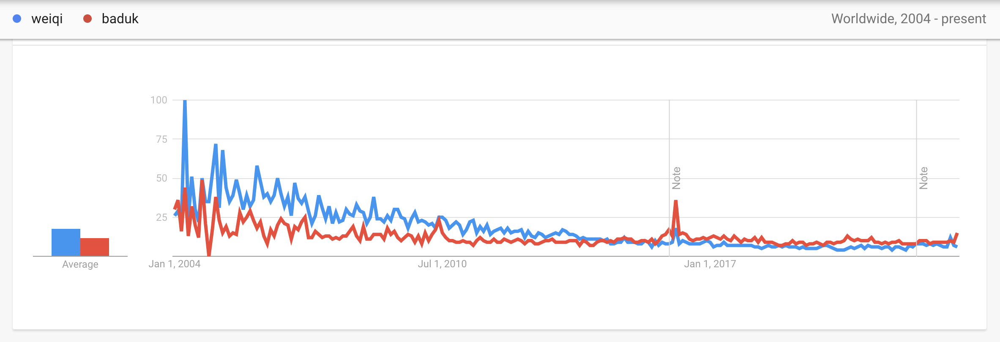

 # El Nombre del Juego
 
 Hoy hablo del nombre del juego tablero chino más antiguo y más avanzado a la vez, el juego conocido como "go" en varios idiomas del resto del mundo, incluso el español.

La palabra "go" proviene del japonés, pero el juego es de China. El juego se llama "weiqi" en chino, pero dudo que muchas personas sepan este nombre.

Entonces por qué el mundo toma el nombre japonés y no el chino? 

Primero, entre los tres países donde la gente juega el juego a nivel avanzado (China, Corea y Japón), El Japón era el primero país que había abierto sus bordes y establecido una significante conexión cultural al occidente. Segundo, Japón había mantenido la ventaja técnica y cultural de este juego hasta el fin del siglo XX. Y por último, los jugadores japoneses tomaban literalmente sus vidas popularizando el juego: [Kaoru Iwamoto](https://es.wikipedia.org/wiki/Iwamoto_Kaoru) (岩本 薫) ayudó a fundar numerosas asociaciones de go en las Américas durante la jubilación. [Hans Pietsch](https://es.wikipedia.org/wiki/Hans_Pietsch), jugador de Alemán y estudiante de [Kobayashi Satoru](https://es.wikipedia.org/wiki/Satoru_Kobayashi) (小林 觉, jugador profesional japonés), falleció de asalto en Guatemala cuando estaba promocionando el juego.

Por otra parte, Corea y China estaban en turbulencia social, político y económico en la major parte del siglo XIX y XX. Solo han establecido su competencia en este juego en el fin del siglo XX.

Francamente no me gusta el nombre "go". Es muy confuso: En ingles "go" es un verbo comunísimo. En español no hay otro sustantivo de tal forma. 

Pero qué tal el nombre chino? Es peor: Weiqi. Nadie excepto los chinos sabe como pronunciarlo.

El nombre coreano, "baduk", es el mas pronunciable para todos (salvo los chinos, que no saben qué hacer con el consonante final). Y el subreddit de este juego ha tomado este nombre `r/baduk`. También hay `r/weiqi` pero no tiene más que 4 usuarios activos.

Creo que de aquí surgió una guerra cultural secreta entre Corea y China, y China está perdiendo. Los coreanos usan "baduk" en los videos de YouTube aunque están dando lecturas y comentarios en inglés. Y los chinos - Disculpen. No he encontrado ningún cuenta china de weiqi de habla inglesa. Y según el [Google Trends](https://trends.google.com/trends/explore?date=all&q=weiqi,baduk), el mundo preferió weiqi antes del año 2014, y "baduk" después.

